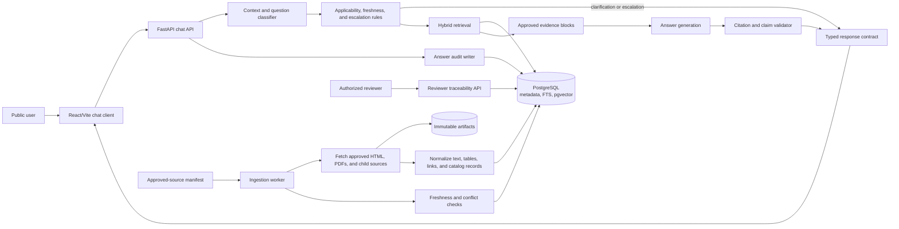

# Implementation Plan: Authoritative University Information Chatbot

**Branch**: `001-authoritative-university-chatbot` | **Date**: 2026-09-17 | **Spec**: [spec.md](./spec.md)

**Input**: Feature specification from `/specs/001-authoritative-university-chatbot/spec.md`

**Note**: This template is filled in by the `/speckit-plan` command; its definition describes the execution workflow.

## Summary

Build a public Purdue University Northwest chatbot that answers general university questions from approved, traceable, current sources. The implementation will separate deterministic source ingestion, applicability and freshness checks, hybrid retrieval, citation validation, and escalation rules from conversational answer generation. The initial delivery is a small web application with a Python API, a minimal browser client, PostgreSQL-backed source/retrieval data, and immutable source artifacts.

## Architecture

The system uses a public browser client and a Python API for conversational access. A separate ingestion pipeline acquires only approved PNW sources, preserves immutable artifacts, normalizes source content into citation-ready blocks, and records freshness and applicability metadata. The answer pipeline resolves missing context and safety conditions before using hybrid retrieval; generated responses are validated against retrieved evidence before being returned with citations, limitations, or escalation guidance. Reviewer endpoints expose the stored audit trail without exposing private student records.



## Technical Context

<!--
  ACTION REQUIRED: Replace the content in this section with the technical details
  for the project. The structure here is presented in advisory capacity to guide
  the iteration process.
-->

**Language/Version**: Python 3.12; TypeScript for the browser client

**Primary Dependencies**: FastAPI, Pydantic, SQLAlchemy, PostgreSQL with pgvector and full-text search, httpx, BeautifulSoup/Trafilatura, Playwright for selected JavaScript pages, PyMuPDF, React, Vite

**Storage**: PostgreSQL for source metadata, normalized content, structured schedule/catalog records, retrieval indexes, and answer audits; immutable object/filesystem storage for fetched HTML/PDF artifacts

**Testing**: pytest unit and integration tests, API contract tests, parser fixtures, and a versioned golden evaluation set for answer and escalation behavior

**Target Platform**: Dockerized Linux services orchestrated with Docker Compose for local development and pilot deployment; the browser frontend is served as a static container

**Project Type**: Public web application with an ingestion worker and reviewer traceability endpoints

**Performance Goals**: Return clarification, unsupported, and cached answers within 2 seconds at p95; return retrieval-grounded answers within 8 seconds at p95 under ordinary pilot load; complete scheduled ingestion without silently skipping failed sources

**Deployment**: Docker is the deployment tool. Dockerfiles build reproducible backend and frontend images, while `docker-compose.yml` runs the API, ingestion worker, frontend, PostgreSQL with pgvector, and local immutable artifact storage. Production secrets and persistent database/artifact volumes are supplied through deployment environment configuration, not committed files.

**Constraints**: Public access without sign-in; no private student-record access; only approved PNW sources; no current time-sensitive answer without a reliable update date; every factual answer must retain source and applicability traceability; containers must not bake credentials into images

**Scale/Scope**: Initial pilot for Purdue University Northwest, including Hammond and Westville; tens to hundreds of approved seed sources, nested pages and PDFs, and ordinary student/faculty/staff traffic rather than enterprise-scale throughput

## Constitution Check

*GATE: Must pass before Phase 0 research. Re-check after Phase 1 design.*

The design passes the constitution gate:

- Approved Information First: ingestion uses an explicit approved-source allowlist and answer retrieval is restricted to approved source records.
- Source Traceability: normalized blocks retain source, office, URL, version, and page/section location; answer contracts require citations.
- Temporal Accuracy: source status and reliable update dates are mandatory for current deadline or policy answers.
- Uncertainty and Escalation: missing context, conflicts, stale data, and unsupported/personalized questions produce clarification or escalation outcomes.
- Safe and Faithful Communication: the answer validator rejects unsupported claims and permits an explicit “I don't know” response.
- Reviewable Requirements Before Implementation: this plan, contracts, data model, and quickstart define reviewable implementation and validation targets.

No constitution violations require an exception.

## Project Structure

### Documentation (this feature)

```text
specs/001-authoritative-university-chatbot/
├── plan.md              # This file (/speckit-plan command output)
├── research.md          # Phase 0 output (/speckit-plan command)
├── data-model.md        # Phase 1 output (/speckit-plan command)
├── quickstart.md        # Phase 1 output (/speckit-plan command)
├── contracts/           # Phase 1 output (/speckit-plan command)
└── tasks.md             # Phase 2 output (/speckit-tasks command - NOT created by /speckit-plan)
```

### Source Code (repository root)

```text
backend/
├── app/
│   ├── api/
│   ├── answering/
│   ├── ingestion/
│   ├── retrieval/
│   ├── models/
│   └── persistence/
└── tests/
    ├── contract/
    ├── integration/
    ├── fixtures/
    └── unit/
frontend/
├── src/
│   ├── components/
│   ├── features/chat/
│   └── services/
└── tests/
data/
├── approved-sources/
└── artifacts/
scripts/
└── ingest/
Dockerfile.backend
Dockerfile.frontend
docker-compose.yml
.dockerignore
```

**Structure Decision**: Use a small monorepo with a browser client, Python backend, ingestion scripts, test fixtures, and Docker deployment descriptors. Keep source acquisition and parsing in `backend/app/ingestion`, retrieval and answer safety in separate modules, preserve raw source artifacts under `data/artifacts` outside application code, and use Docker Compose to connect the frontend, API, ingestion worker, and PostgreSQL services.

## Complexity Tracking

No constitution violations require complexity justification.
