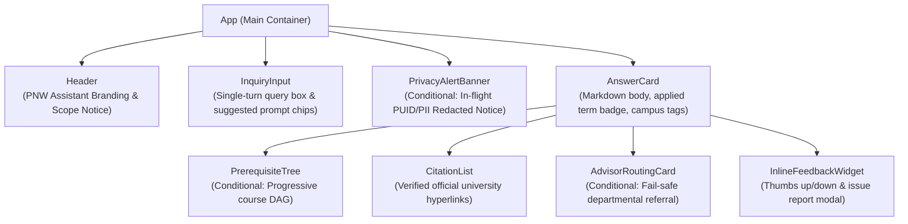

# UI Component Contracts: React Frontend

**Feature**: `001-pnw-info-assistant`
**Date**: 2026-09-16
**Status**: Complete

## 1. Overview & Layout Hierarchy

The frontend is a single-turn, accessible React application optimized for desktop and mobile web browsers.
No user authentication is required. The UI layout consists of:



---

## 2. Core Component Interfaces

### 2.1 `InquiryInput`
Captures student single-turn queries and handles submission.

```typescript
interface InquiryInputProps {
  onSubmit: (query: string) => void;
  isLoading: boolean;
  disabled?: boolean;
}
```

### 2.2 `AnswerCard`
Renders the primary step-by-step grounded response.

```typescript
interface AnswerCardProps {
  queryId: string;
  answerMarkdown: string;
  appliedTerm?: string | null;
  outcome: 'GROUNDED_ANSWER' | 'FAIL_SAFE_ROUTED' | 'OUT_OF_SCOPE';
  citations: CitationItem[];
  departmentContact?: DepartmentContactInfo | null;
  prerequisiteHierarchy?: PrerequisiteHierarchyData | null;
  piiDetected: boolean;
  privacyNotice?: string | null;
}
```

### 2.3 `PrerequisiteTree`
Visualizes the multi-level prerequisite chain with branch logic and minimum grade requirements (FR-005).

```typescript
interface PrerequisiteTreeProps {
  data: PrerequisiteHierarchyData;
  onNodeClick?: (courseCode: string) => void;
}

interface PrerequisiteHierarchyData {
  courseCode: string;
  title: string;
  credits: number;
  prerequisiteGroups: {
    groupId: number;
    logicOperator: 'AND' | 'OR';
    options: PrerequisiteCourseNode[];
  }[];
}

interface PrerequisiteCourseNode {
  courseCode: string;
  title: string;
  minGrade: string; // e.g. "C", "C-", "B"
  isCorequisite: boolean; // can take concurrently
  subPrerequisites?: PrerequisiteCourseNode[];
}
```

### 2.4 `CitationList`
Displays official university links and document titles (Constitution Principle I, FR-002, SC-001).

```typescript
interface CitationItem {
  title: string;
  sourceUrl: string;
  sectionHeading?: string | null;
  campusScope: 'HAMMOND' | 'WESTVILLE' | 'ALL';
}

interface CitationListProps {
  citations: CitationItem[];
}
```

### 2.5 `AdvisorRoutingCard`
Displays official departmental escalation details when information is ungrounded or personal (Constitution Principle II, FR-006, FR-007).

```typescript
interface DepartmentContactInfo {
  officeName: string;
  contactEmail: string;
  phoneNumber: string;
  campus: 'HAMMOND' | 'WESTVILLE' | 'ALL';
  buildingRoom: string;
  websiteUrl: string;
  officeHours?: string | null;
}

interface AdvisorRoutingCardProps {
  contact: DepartmentContactInfo;
  reason?: string;
}
```

### 2.6 `InlineFeedbackWidget`
Provides binary rating and anonymous issue reporting (FR-012, SC-007).

```typescript
interface InlineFeedbackWidgetProps {
  queryId: string;
  onFeedbackSubmitted?: (feedbackId: string) => void;
}

interface FeedbackPayload {
  queryId: string;
  sentiment: 'HELPFUL' | 'UNHELPFUL';
  issueCategory?: 'OUTDATED_INFO' | 'BROKEN_LINK' | 'INCORRECT_RULE' | 'OTHER';
  comment?: string;
}
```

### 2.7 `PrivacyAlertBanner`
Displays privacy alert when student ID or personal information was detected and masked in-flight (FR-007).

```typescript
interface PrivacyAlertBannerProps {
  message: string;
  visible: boolean;
}
```
