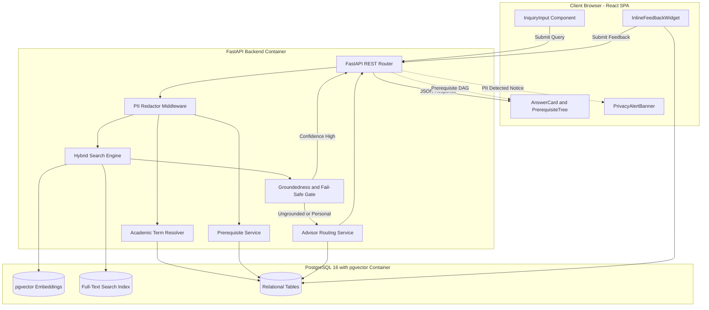
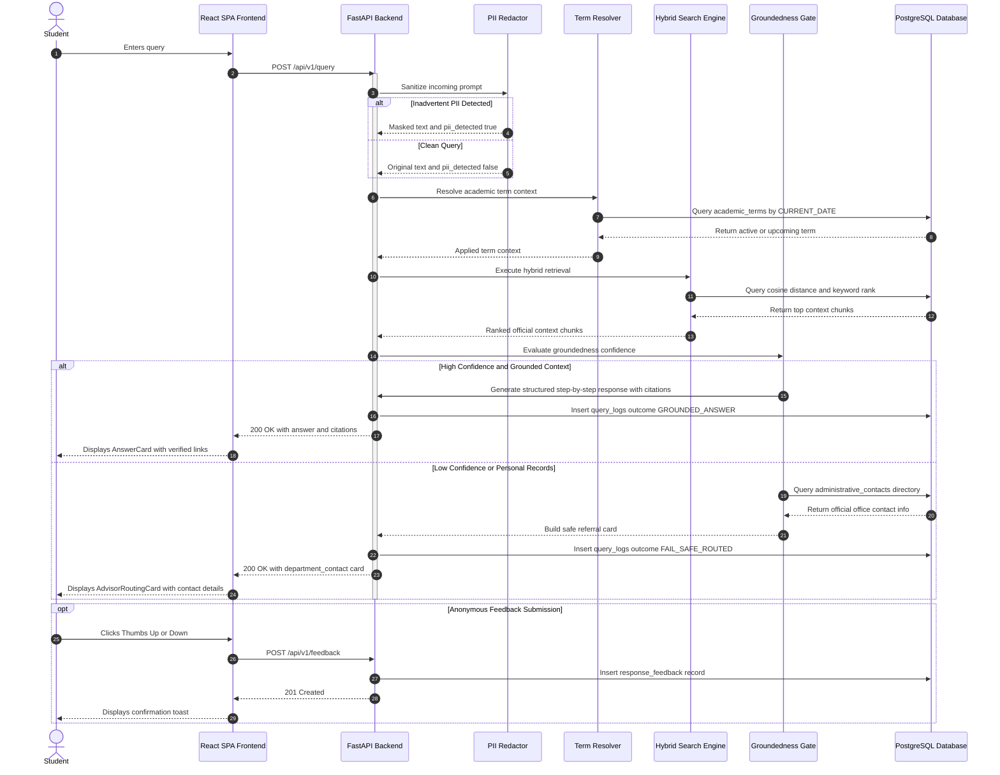

# Implementation Plan: PNW Student Information & Advising Assistant

**Branch**: `001-pnw-info-assistant` | **Date**: 2026-09-16 | **Spec**: [spec.md](./spec.md)

**Input**: Feature specification from `specs/001-pnw-info-assistant/spec.md`, clarified through user interview notes and 5 resolved specification clarification items. Tech stack specified: **FastAPI**, **React**, **PostgreSQL with pgvector**, and **Docker**.

---

## Summary

The PNW Student Information & Advising Assistant is a containerized, single-turn, stateless web application designed to help Purdue University Northwest students find grounded answers to university policies, registration/refund deadlines, and multi-level course prerequisite chains. 

The system couples a **FastAPI** backend with a **React** (TypeScript + Vite) frontend and a **PostgreSQL 16** database with `pgvector`. Retrieval is powered by hybrid vector cosine similarity and full-text keyword search against ingested PNW policy documents and catalog tables. To uphold project Constitution Principles, the assistant features in-flight PII redaction, strict citation grounding with active official links, automatic calendar term resolution, progressive prerequisite tree visualization, and a deterministic fail-safe routing mechanism directing students to university offices when answers cannot be verified.

---

## Technical Context

**Language/Version**: Python 3.11+ (Backend), TypeScript 5.0+ / Node.js 20+ (Frontend)

**Primary Dependencies**:
- *Backend*: FastAPI, Uvicorn, SQLAlchemy (asyncpg), pgvector, Pydantic v2, Alembic, httpx, `google-genai` (Google Gemini SDK)
- *Frontend*: React 18, Vite, TypeScript, Lucide React, Tailwind CSS

**LLM & Embedding Models (Free Tier)**:
- *Generation Model*: **Google Gemini 1.5 Flash** (`gemini-1.5-flash`) via the Google AI Studio free tier (generous 15 RPM, 1M TPM, 1,500 RPD free tier without billing requirements).
- *Embedding Model*: **Google `text-embedding-004`** (768 dimensions, native pgvector integration) with local HuggingFace `sentence-transformers/all-MiniLM-L6-v2` offline fallback.

**Storage**: PostgreSQL 16 with `pgvector` extension (`pgvector/pgvector:pg16` Docker image); relational tables for documents, chunks, terms, courses, prerequisites, contacts, query traces, and feedback.

**Testing**: `pytest`, `pytest-asyncio`, `pytest-cov`, `httpx` (Backend tests); `Vitest`, `React Testing Library` (Frontend tests).

**Target Platform**: Containerized Linux server via Docker & Docker Compose (`docker-compose.yml`).

**Project Type**: Full-stack web application (Decoupled FastAPI backend service + React SPA frontend).

**Performance Goals**:
- P95 query response time < 3.0 seconds (retrieval + grounding + citation formatting).
- Direct prerequisite graph and calendar term lookups < 500ms.
- 100% service uptime for static contact referrals during database cold start.

**Constraints**:
- Single-turn stateless Q&A: No multi-turn session context or chat history retained.
- Constitution Principle I: 100% of policy and deadline statements must cite verified official university URLs.
- Constitution Principle II: When information is ungrounded or ambiguous, the system must fail safely by directing the user to official department contacts.
- In-flight PII Sanitization: Mask 9-digit PUIDs and personal student records before logging or processing (FERPA).
- Public access: No student login or authentication required for v1.

**Scale/Scope**:
- Serving current and prospective PNW students (~9,000 students across Hammond and Westville campuses).
- Ingested knowledge corpus: ~50-100 official PNW policy documents, academic catalog entries, prerequisite chains, and deadline tables.

---

## Constitution Check

*GATE: Must pass before Phase 0 research. Re-checked after Phase 1 design.*

| Principle | Spec Requirement | Architecture & Design Verification | Status |
|-----------|------------------|------------------------------------|--------|
| **I. Grounded Answers** | FR-001, FR-002, SC-001 | Hybrid vector + keyword retrieval restricts generation context strictly to ingested official chunks; response payload requires verified citations (`source_url`, `title`, `campus_scope`). | **PASS** |
| **II. Fail Safely** | FR-006, FR-007, SC-002, SC-005 | Two-tier confidence gate (< 0.35 cosine distance threshold); ungrounded or personal account inquiries trigger deterministic `AdvisorRoutingCard` with office name, email, phone, and building/room. | **PASS** |
| **III. Requirements Before Implementation** | All FRs & SCs | Specification clarified across all 5 key decision points (conversational model, term resolution, PII handling, prerequisite depth, inline feedback) in `spec.md`. | **PASS** |

---

## System Architecture & Component Interactions

The system follows a containerized 3-tier architecture adhering to Constitution Principles I (*Grounded Answers*) and II (*Fail Safely*). All client interactions are single-turn and stateless.

### Architectural Component Diagram



### Major Components & Their Interactions

1. **Frontend Presentation Layer (React + TypeScript + Vite)**:
   - **`InquiryInput`**: Captures student queries statelessly, presenting quick-start chips for common inquiries (parking citations, prerequisite chains, drop deadlines).
   - **`AnswerCard`**: Renders Markdown-formatted step-by-step guidance, source citations with active hyperlinks, campus applicability tags (`Hammond`, `Westville`, or `All`), and applied academic term indicators.
   - **`PrerequisiteTree`**: Renders an interactive, progressive dependency DAG when course sequencing is requested, visibly annotating minimum letter grades (`C or higher`), concurrent corequisites, and `AND`/`OR` pathway logic.
   - **`AdvisorRoutingCard`**: Displays verified departmental contact information (office name, email, phone, building/room, hours) whenever an inquiry cannot be grounded or requires personal account access.
   - **`InlineFeedbackWidget`**: Collects anonymous binary ratings and optional issue reports to audit answer accuracy and link health (FR-012, SC-007).
   - **`PrivacyAlertBanner`**: Alerts the student when personal identifiers were detected and masked in-flight.

2. **API & Application Layer (FastAPI)**:
   - **`PIIRedactor`**: In-flight regex and pattern scrubber that sanitizes 9-digit PUIDs, Social Security numbers, and contact details before vector search or persistence, setting `pii_detected=True` (FR-007).
   - **`TermResolver`**: Compares `CURRENT_DATE` against ingested semester start/end and drop deadlines to resolve the active term (or advance to the upcoming term during breaks or post-drop cutoffs) (FR-003).
   - **`PrerequisiteService`**: Recursively traverses `course_prerequisites` up to 5 levels deep, grouping dependencies by `group_id` and formatting them into a structured tree (FR-005).
   - **`HybridSearchEngine`**: Executes concurrent dense vector search (`vector_cosine_ops`) and PostgreSQL full-text search (`tsvector @@ plainto_tsquery`) to ensure high recall for natural language questions and exact matching for alphanumeric course codes (e.g., `CS 30200`).
   - **`GroundedGenerator & GroundingGate`**: Enforces Constitution Principle I by prompting Google Gemini 1.5 Flash (`gemini-1.5-flash` free tier API) with retrieved context chunks under strict system instructions to cite official source URLs. If cosine distance is >= 0.35 (insufficient grounding) or the prompt targets private records, it invokes the `FallbackRouter` directly to fail safely.
   - **`FallbackRouter`**: Queries `administrative_contacts` to return an official office referral without guessing (Constitution Principle II).

3. **Storage Layer (PostgreSQL 16 with `pgvector`)**:
   - Stores vectorized document chunks with `ivfflat` indexing for semantic search.
   - Stores GIN indexes on `tsv` generated columns for keyword lookup.
   - Houses relational tables for `academic_terms`, `courses`, `course_prerequisites`, `administrative_contacts`, `query_logs`, and `response_feedback`.

---

## Request Flow

The sequence diagram below details the end-to-end execution path for single-turn student inquiries, demonstrating how in-flight PII redaction, hybrid retrieval, confidence gating, and fail-safe routing interact:



---

## Project Structure

### Documentation (this feature)

```text
specs/001-pnw-info-assistant/
├── plan.md              # Master implementation plan (this file)
├── research.md          # Phase 0: Technical decisions and architectural research
├── data-model.md        # Phase 1: Database entities, relational schema, and vector indexes
├── quickstart.md        # Phase 1: Runnable Docker Compose instructions and validation scenarios
├── contracts/           # Phase 1: Formal API & UI component specifications
│   ├── api-contracts.md # REST API endpoint contracts
│   └── ui-contracts.md  # React component interfaces and layout hierarchy
└── tasks.md             # Phase 2: Actionable tasks generated by /speckit-tasks
```

### Source Code Layout (repository root)

```text
.
├── docker-compose.yml          # Container orchestration (db, backend, frontend)
├── .env.example                # Sample environment configuration
│
├── backend/                    # FastAPI Backend Service
│   ├── Dockerfile
│   ├── pyproject.toml
│   ├── requirements.txt
│   ├── alembic/                # Database migrations
│   │   └── versions/
│   ├── src/
│   │   ├── main.py             # Application entrypoint & middleware
│   │   ├── config.py           # Pydantic BaseSettings
│   │   ├── database.py         # Async SQLAlchemy session factory
│   │   ├── models/             # SQLAlchemy ORM models
│   │   │   ├── __init__.py
│   │   │   ├── document.py     # documents & document_chunks (with pgvector)
│   │   │   ├── academic_term.py# academic_terms (dates & drop deadlines)
│   │   │   ├── course.py       # courses & course_prerequisites
│   │   │   ├── contact.py      # administrative_contacts
│   │   │   └── query_log.py    # query_logs & response_feedback
│   │   ├── schemas/            # Pydantic v2 schemas
│   │   │   ├── query.py
│   │   │   ├── feedback.py
│   │   │   ├── course.py
│   │   │   └── contact.py
│   │   ├── services/           # Core business and retrieval logic
│   │   │   ├── pii_redactor.py # In-flight PUID & sensitive data masking
│   │   │   ├── term_resolver.py# Calendar date mapping & upcoming term advance
│   │   │   ├── prerequisite_service.py # Recursive prerequisite DAG builder
│   │   │   ├── vector_search.py# Hybrid pgvector + full-text search engine
│   │   │   └── grounded_generator.py   # Grounded response synthesis & citation binder
│   │   ├── api/                # FastAPI Routers
│   │   │   ├── v1/
│   │   │   │   ├── query.py    # POST /api/v1/query
│   │   │   │   ├── feedback.py # POST /api/v1/feedback
│   │   │   │   ├── courses.py  # GET /api/v1/courses/{code}/prerequisites
│   │   │   │   ├── terms.py    # GET /api/v1/terms/active
│   │   │   │   └── health.py   # GET /api/v1/health
│   │   └── scripts/
│   │       ├── ingest_corpus.py# Ingestion script for PNW PDFs and HTML docs
│   │       └── seed_data.py    # Seed academic calendar, catalog, and office contacts
│   └── tests/
│       ├── conftest.py
│       ├── unit/
│       ├── integration/
│       └── contract/
│
└── frontend/                   # React Frontend SPA
    ├── Dockerfile
    ├── package.json
    ├── vite.config.ts
    ├── tsconfig.json
    ├── index.html
    ├── src/
    │   ├── main.tsx
    │   ├── App.tsx             # Main layout container
    │   ├── components/
    │   │   ├── Header.tsx      # PNW branding & scope disclaimers
    │   │   ├── InquiryInput.tsx# Single-turn input box with suggested questions
    │   │   ├── AnswerCard.tsx  # Grounded answer container with term/campus badges
    │   │   ├── PrerequisiteTree.tsx # Progressive visual tree for course dependencies
    │   │   ├── CitationList.tsx# Verified official university source links
    │   │   ├── AdvisorRoutingCard.tsx # Fail-safe escalation office contact card
    │   │   ├── InlineFeedbackWidget.tsx # Thumbs up/down + issue reporting modal
    │   │   └── PrivacyAlertBanner.tsx   # PII detection & masking notice
    │   ├── services/
    │   │   └── api.ts          # Axios / fetch client calling FastAPI backend
    │   └── types/
    │       └── index.ts        # TypeScript interfaces matching OpenAPI schema
    └── tests/
        └── components/
```

---

## Complexity Tracking

| Violation | Why Needed | Simpler Alternative Rejected Because |
|-----------|------------|-------------------------------------|
| *None* | N/A | Design uses minimal 3-tier architecture (FastAPI + React + Postgres/pgvector) matching user requirements and constitution. |
