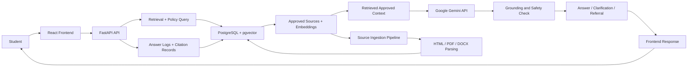

# Implementation Plan: Purdue Policy Chatbot and RAG Knowledge-Base Preparation

**Branch**: `001-purdue-policy-chatbot` | **Date**: `2026-09-16` | **Spec**: `specs/001-purdue-policy-chatbot/spec.md`

**Input**: Feature specification from `specs/001-purdue-policy-chatbot/spec.md`, with the requested addition of a repeatable workflow for preparing the vector database used by RAG.

## Summary

Build a student-facing Purdue Northwest policy chatbot and a controlled source-preparation workflow. Approved HTML, PDF, and DOC/DOCX sources are parsed into structure-aware segments, validated, embedded, and loaded into PostgreSQL + pgvector as a versioned knowledge-base release. The chatbot retrieves only active, approved segments, cites them, and safely refuses unsupported or uncertain guidance.

## Technical Context

**Language/Version**: Python 3.12 managed with `uv`, Node.js 20 LTS

**Primary Dependencies**: `uv` for Python project and lockfile management, FastAPI, React, PostgreSQL, pgvector, Docker Compose, Pydantic, SQLAlchemy, HTML/PDF/DOCX parsing libraries, an embedding provider, Google Gemini API on its available free tier for answer generation, and a vector-retrieval layer for grounded answer generation

**Storage**: PostgreSQL with pgvector extension for source manifests, immutable source versions, structure-aware chunks, embeddings, validation results, and active knowledge-base releases; local Docker volumes are sufficient for the first release

**Testing**: `uv run pytest` for ingestion and backend services; React/Vitest or Jest for frontend; contract validation; fixture-based parser tests; embedding/index integration tests; end-to-end smoke tests for ingestion activation, chat retrieval, and unsafe-answer handling

**Target Platform**: Linux containers deployed via Docker; browser-based student web app

**Project Type**: web-application

**Performance Goals**: p95 answer latency under 5 seconds for standard student questions; a normal source refresh must validate and index a small-to-medium corpus without requiring downtime; knowledge-base activation must be atomic

**Constraints**: Use `uv` rather than pip, Poetry, or an unmanaged virtual environment for all Python dependency installation and execution; commit `backend/pyproject.toml` and `backend/uv.lock`; use only approved Purdue Northwest sources; preserve source provenance and structural context; failed or unreviewed parses cannot be indexed as authoritative; stale versions must not remain active after replacement; embedding credentials remain server-side; safe fallback behavior is required; no sign-in requirement for public student access in the first release

**Scale/Scope**: Small-to-medium public web app; tens of thousands of source chunks and question traffic manageable within one PostgreSQL + pgvector instance; refreshes are batch-oriented and initiated by an authorized operator or deployment job

## Constitution Check

*GATE: Must pass before Phase 0 research. Re-check after Phase 1 design.*

- PASS: Grounded Answers. The design is built around approved source retrieval, citation metadata, and source-grounded answer generation.
- PASS: Fail Safely. The architecture includes low-confidence fallback, safe referral, and escalation paths for unsupported or conflicting material.
- PASS: Requirements Before Implementation. The spec contains explicit acceptance criteria, edge cases, and measurable outcomes; the requested preparation workflow is bounded to approved-source loading and does not introduce a staff-facing source-management product.
- PASS: Additional constraints. Source provenance, freshness, parse review, release activation, and safe-failure behavior are first-class requirements.

## Project Structure

```text
backend/
├── app/
│   ├── api/
│   │   ├── routes/
│   │   └── deps.py
│   ├── core/
│   │   ├── config.py
│   │   ├── logging.py
│   │   └── security.py
│   ├── models/
│   │   ├── source.py
│   │   ├── source_chunk.py
│   │   ├── answer_log.py
│   │   └── review_record.py
│   ├── schemas/
│   │   ├── chat.py
│   │   ├── source.py
│   │   └── review.py
│   ├── services/
│   │   ├── ingestion/
│   │   │   ├── manifest.py
│   │   │   ├── parser.py
│   │   │   ├── html.py
│   │   │   ├── pdf.py
│   │   │   └── docx.py
│   │   │   ├── normalize.py
│   │   │   ├── chunk.py
│   │   │   ├── embed.py
│   │   │   ├── validate.py
│   │   │   └── publish.py
│   │   ├── retrieval.py
│   │   ├── answering.py
│   │   ├── citation.py
│   │   └── referral.py
│   ├── db/
│   │   ├── session.py
│   │   └── migrations/
│   └── main.py
├── scripts/
│   └── prepare_knowledge_base.py
├── tests/
│   ├── unit/
│   ├── integration/
│   └── contract/
├── pyproject.toml
├── uv.lock
└── README.md

frontend/
├── src/
│   ├── app/
│   ├── components/
│   ├── hooks/
│   ├── pages/
│   ├── services/
│   └── styles/
├── public/
├── package.json
├── vite.config.ts
└── tests/

docker/
├── backend.Dockerfile
├── frontend.Dockerfile
├── docker-compose.yml
└── nginx.conf

specs/001-purdue-policy-chatbot/
├── spec.md
├── plan.md
├── research.md
├── data-model.md
├── quickstart.md
├── contracts/
│   ├── chat-api.md
│   └── knowledge-base-preparation-cli.md
└── tasks.md
```

**Structure Decision**: Split frontend and backend into independent application directories with a shared Docker Compose deployment layer. This keeps the user interface separate from the policy retrieval and citation logic while enabling a single PostgreSQL + pgvector database and a clean, testable deployment model.

**Package Management Decision**: The backend is an independent `uv` project rooted at `backend/`. Dependencies are declared in `backend/pyproject.toml`, resolved into `backend/uv.lock`, installed with `uv sync`, and run with `uv run`. Docker and documentation must use these commands rather than `pip install` or a manually activated virtual environment.

## Architecture

The system is organized as a small three-part web application: a React frontend for student interaction, a FastAPI backend for policy retrieval and response generation, and a PostgreSQL + pgvector database for approved source content and embeddings.

### Major components and interactions

- Frontend web app
  - Renders the student chat interface and question form.
  - Sends questions to the backend API.
  - Displays the answer, source citations, and referral guidance.
  - Handles lightweight UX states like loading, no-answer, and unsafe fallback messaging.

- FastAPI backend
  - Accepts student questions and optional undergraduate or graduate student context.
  - Validates and normalizes requests.
  - Queries the source corpus using semantic and metadata filters.
  - Selects the most relevant approved segments, sends only the retrieved approved context to the Google Gemini API for answer drafting, checks the result for grounding, and triggers the safe-failure/referral logic when the answer is unsupported or uncertain.
  - Persists answer logs and citation records for review.

- Google Gemini API
  - Generates a concise answer from the student's question and retrieved approved source segments.
  - Must not be treated as an independent source of Purdue Northwest policy.
  - Is accessed through a backend-only API key stored in environment configuration; keys must never be exposed to the React client or committed to the repository.
  - The implementation must handle quota limits, unavailable service, and other API failures by returning a safe referral rather than an unsupported answer.

- Source ingestion and parsing pipeline
  - Reads an explicit approved-source manifest containing canonical identity, source type, owner, effective/review dates, and supersession status.
  - Fetches or reads each source, computes a content hash, and parses HTML, PDF, and DOC/DOCX into ordered structural blocks for headings, paragraphs, tables, lists, sidebars, and callouts.
  - Normalizes whitespace and table/list representations without discarding section context, then creates bounded chunks with stable source-location metadata and deterministic chunk IDs.
  - Generates embeddings with a pinned model configuration, writes them to an isolated knowledge-base release, and builds the pgvector index after content validation.
  - Runs quality gates for parse completeness, empty/duplicate content, metadata validity, embedding dimensions, and source approval. Any failed or unreviewed item is excluded from the publishable release and recorded for review.
  - Publishes a release by switching one active-release pointer in a transaction; the previous release remains available for audit and rollback but is not used for current answers.

- PostgreSQL + pgvector
  - Stores approved sources, source chunks, metadata, embeddings, and answer/audit records.
  - Supports semantic similarity search and filtered retrieval by source status, term, and policy category.
  - Keeps source freshness and audit data available for investigators and reviewers.

- Docker deployment layer
  - Runs the frontend, backend, and database as separate services.
  - Provides a consistent local environment for development and a repeatable deployment pattern for hosted environments.

### Runtime interaction flow

1. The student submits a question in the React UI.
2. The frontend sends the request to the FastAPI `/api/chat` endpoint.
3. The backend retrieves relevant source segments from PostgreSQL + pgvector.
4. The backend sends the question and retrieved approved context to Google Gemini for answer drafting.
5. The backend evaluates whether the draft is grounded, ambiguous, or unsupported.
6. If grounded, it composes a response with citations and an answer confidence score.
7. If low-confidence, unsupported, or unavailable because of an LLM/API failure, it returns a safe referral or requests a targeted clarification.
8. The answer and metadata are stored for later auditing and source review.

### Knowledge-base preparation workflow

1. An authorized operator supplies an approved-source manifest and source files or URLs.
2. The preparation command creates a new release in `preparing` state and snapshots the manifest.
3. Each source is fetched, hashed, parsed, normalized, and converted to structure-aware chunks with page/section/table/list locations.
4. The command validates source status, parser output, required metadata, chunk bounds, and embedding dimensions.
5. Valid chunks are embedded and inserted into the new release; failed sources create parsing-review records and remain unavailable to retrieval.
6. The command runs retrieval smoke checks against representative questions and verifies that citations resolve to the new release.
7. If all release gates pass, the command atomically marks the release `active` and retires the prior active release. Otherwise, it leaves the release `rejected` or `pending_review` and preserves the prior active release.



## Complexity Tracking

No constitution violations identified; no complexity exceptions required. The batch preparation command is an operational interface, not a staff-facing source-management product, so it remains within the first-release scope.

## Constitution Check (Post-Design)

- PASS: Grounded Answers. Only approved, successfully parsed chunks from the active knowledge-base release are eligible for retrieval, and citations retain source identity and location.
- PASS: Fail Safely. Failed, incomplete, stale, conflicting, or unreviewed sources are excluded; failed release activation leaves the prior active release unchanged.
- PASS: Requirements Before Implementation. The preparation command, release gates, review records, and validation scenarios are explicitly documented before implementation.
- PASS: Additional constraints. Source freshness, supersession, provenance, parse-review status, and atomic release activation are represented in the data model and contracts.
