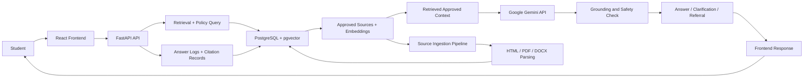

# Implementation Plan: Purdue Policy Chatbot

**Branch**: `001-purdue-policy-chatbot` | **Date**: `2026-09-16` | **Spec**: `specs/001-purdue-policy-chatbot/spec.md`

**Input**: Feature specification from `specs/001-purdue-policy-chatbot/spec.md`

## Summary

Build a student-facing Purdue Northwest policy chatbot that answers common questions about registration, class changes, academic standing, grade appeals, financial aid deadlines, and contact referrals using only approved university information. The system will use a FastAPI backend, React frontend, and PostgreSQL + pgvector for source storage and semantic retrieval, with Docker-based deployment for local and hosted environments. All answers must cite approved sources and safely refuse unsupported or uncertain guidance.

## Technical Context

**Language/Version**: Python 3.12, Node.js 20 LTS

**Primary Dependencies**: FastAPI, React, PostgreSQL, pgvector, Docker Compose, Pydantic, SQLAlchemy, PDF/DOCX/HTML parsing libraries, Google Gemini API on its available free tier for answer generation, and a vector-retrieval layer for grounded answer generation

**Storage**: PostgreSQL with pgvector extension for approved source metadata and vector embeddings; file/object storage not required in the first release beyond local Docker volumes

**Testing**: pytest for backend; React/Vitest or Jest for frontend; API contract validation; end-to-end smoke tests for chat flow and unsafe-answer handling

**Target Platform**: Linux containers deployed via Docker; browser-based student web app

**Project Type**: web-application

**Performance Goals**: p95 answer latency under 5 seconds for standard student questions during normal service conditions; source retrieval and answer generation must complete quickly enough for interactive use

**Constraints**: Use only approved Purdue Northwest sources; avoid unsupported policy claims; maintain source provenance; ensure safe fallback behavior on low-confidence answers; no sign-in requirement for public student access in the first release

**Scale/Scope**: Small-to-medium public web app for student support; tens of thousands of source chunks and question traffic manageable within a single PostgreSQL + pgvector instance in the first release

## Constitution Check

*GATE: Must pass before Phase 0 research. Re-check after Phase 1 design.*

- PASS: Grounded Answers. The design is built around approved source retrieval, citation metadata, and source-grounded answer generation.
- PASS: Fail Safely. The architecture includes low-confidence fallback, safe referral, and escalation paths for unsupported or conflicting material.
- PASS: Requirements Before Implementation. The spec contains explicit acceptance criteria, edge cases, and measurable outcomes; no material ambiguity remains.
- PASS: Additional constraints. The design keeps source provenance, freshness, and safe-failure behavior as first-class requirements instead of afterthoughts.

## Project Structure

```text
backend/
├── app/
│   ├── api/
│   │   ├── routes/
│   │   └── deps.py
│   ├── core/
│   │   ├── config.py
│   │   ├── logging.py
│   │   └── security.py
│   ├── models/
│   │   ├── source.py
│   │   ├── source_chunk.py
│   │   ├── answer_log.py
│   │   └── review_record.py
│   ├── schemas/
│   │   ├── chat.py
│   │   ├── source.py
│   │   └── review.py
│   ├── services/
│   │   ├── ingestion/
│   │   │   ├── parser.py
│   │   │   ├── html.py
│   │   │   ├── pdf.py
│   │   │   └── docx.py
│   │   ├── retrieval.py
│   │   ├── answering.py
│   │   ├── citation.py
│   │   └── referral.py
│   ├── db/
│   │   ├── session.py
│   │   └── migrations/
│   └── main.py
├── tests/
│   ├── unit/
│   ├── integration/
│   └── contract/
└── requirements.txt

frontend/
├── src/
│   ├── app/
│   ├── components/
│   ├── hooks/
│   ├── pages/
│   ├── services/
│   └── styles/
├── public/
├── package.json
├── vite.config.ts
└── tests/

docker/
├── backend.Dockerfile
├── frontend.Dockerfile
├── docker-compose.yml
└── nginx.conf

specs/001-purdue-policy-chatbot/
├── spec.md
├── plan.md
├── research.md
├── data-model.md
├── quickstart.md
├── contracts/
│   └── chat-api.md
└── tasks.md
```

**Structure Decision**: Split frontend and backend into independent application directories with a shared Docker Compose deployment layer. This keeps the user interface separate from the policy retrieval and citation logic while enabling a single PostgreSQL + pgvector database and a clean, testable deployment model.

## Architecture

The system is organized as a small three-part web application: a React frontend for student interaction, a FastAPI backend for policy retrieval and response generation, and a PostgreSQL + pgvector database for approved source content and embeddings.

### Major components and interactions

- Frontend web app
  - Renders the student chat interface and question form.
  - Sends questions to the backend API.
  - Displays the answer, source citations, and referral guidance.
  - Handles lightweight UX states like loading, no-answer, and unsafe fallback messaging.

- FastAPI backend
  - Accepts student questions and optional undergraduate or graduate student context.
  - Validates and normalizes requests.
  - Queries the source corpus using semantic and metadata filters.
  - Selects the most relevant approved segments, sends only the retrieved approved context to the Google Gemini API for answer drafting, checks the result for grounding, and triggers the safe-failure/referral logic when the answer is unsupported or uncertain.
  - Persists answer logs and citation records for review.

- Google Gemini API
  - Generates a concise answer from the student's question and retrieved approved source segments.
  - Must not be treated as an independent source of Purdue Northwest policy.
  - Is accessed through a backend-only API key stored in environment configuration; keys must never be exposed to the React client or committed to the repository.
  - The implementation must handle quota limits, unavailable service, and other API failures by returning a safe referral rather than an unsupported answer.

- Source ingestion and parsing pipeline
  - Loads approved Purdue Northwest HTML, PDF, and DOC/DOCX sources.
  - Extracts headings, tables, lists, callouts, and other structural segments.
  - Normalizes extracted content and stores chunk-level provenance, metadata, and vector embeddings in PostgreSQL + pgvector.
  - Marks parsing failures or invalid sources as pending review so they are excluded from authoritative answer generation.

- PostgreSQL + pgvector
  - Stores approved sources, source chunks, metadata, embeddings, and answer/audit records.
  - Supports semantic similarity search and filtered retrieval by source status, term, and policy category.
  - Keeps source freshness and audit data available for investigators and reviewers.

- Docker deployment layer
  - Runs the frontend, backend, and database as separate services.
  - Provides a consistent local environment for development and a repeatable deployment pattern for hosted environments.

### Runtime interaction flow

1. The student submits a question in the React UI.
2. The frontend sends the request to the FastAPI `/api/chat` endpoint.
3. The backend retrieves relevant source segments from PostgreSQL + pgvector.
4. The backend sends the question and retrieved approved context to Google Gemini for answer drafting.
5. The backend evaluates whether the draft is grounded, ambiguous, or unsupported.
6. If grounded, it composes a response with citations and an answer confidence score.
7. If low-confidence, unsupported, or unavailable because of an LLM/API failure, it returns a safe referral or requests a targeted clarification.
8. The answer and metadata are stored for later auditing and source review.



## Complexity Tracking

No constitution violations identified; no complexity exceptions required.
